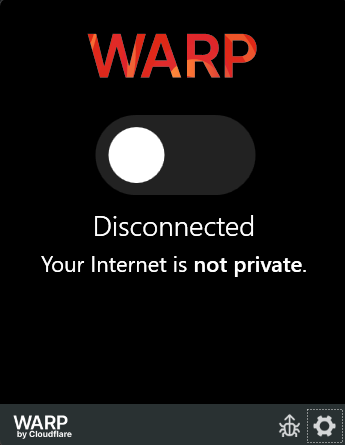
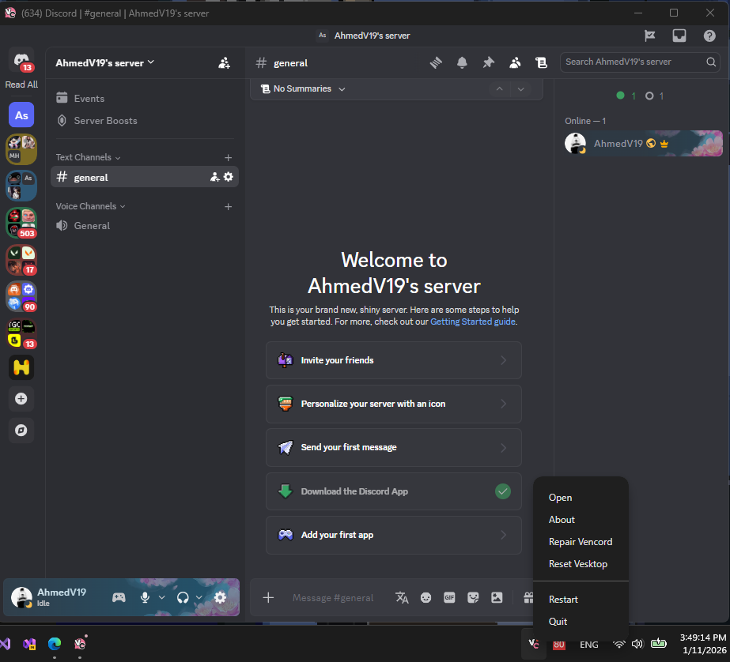
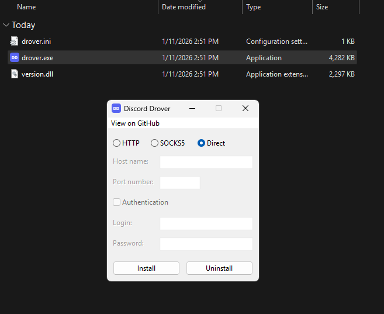
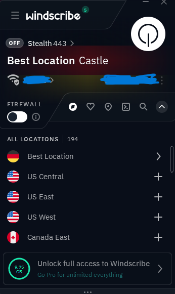

# Discord Access Guide for Egypt

**[العربية](README_AR.md)** | English

[](https://github.com/AhmedV20/discord-egypt-guide/stargazers)  [](https://github.com/AhmedV20/discord-egypt-guide/network/members)  [](LICENSE)

A comprehensive guide with solutions for accessing Discord in Egypt if you experience connection issues.

> [!NOTE]
> Discord is not officially confirmed to be banned in Egypt. However, some users report connectivity issues. This guide provides solutions if you encounter problems.

---

## Table of Contents

- [Method 1: Cloudflare WARP](#method-1-cloudflare-warp)
- [Method 2: Vesktop](#method-2-vesktop)
- [Method 3: Discord-Drover](#method-3-discord-drover)
- [Method 4: VPN Services](#method-4-vpn-services-windscribe)
- [Common Problems in Egypt](#common-problems-in-egypt)
- [Method Comparison](#method-comparison)
- [Contributing](#contributing)
- [License](#license)

---

## Method 1: Cloudflare WARP

### Description

Cloudflare WARP is a free, lightweight VPN-like service that routes your traffic through Cloudflare's global network using the 1.1.1.1 DNS resolver. It encrypts your connection and bypasses regional restrictions without significantly impacting speed.

### Pros

- **Free** — No subscription required for basic functionality
- **Fast** — Minimal speed reduction due to Cloudflare's optimized network
- **Lightweight** — Low system resource usage
- **Cross-platform** — Available on Windows, macOS, Linux, iOS, and Android
- **Always-on protection** — Encrypts all device traffic automatically

### Cons

- Limited server location options (cannot choose specific countries)
- May not work if Cloudflare IPs are blocked
- No split tunneling on mobile
- Occasional connection drops during peak hours

### Requirements

| Requirement | Details |
|-------------|---------|
| **Operating System** | Windows 10+, macOS 10.14+, Linux, iOS 14+, Android 5+ |
| **Admin Permissions** | Required for installation |
| **Account** | Optional (works without login) |
| **Storage** | ~100 MB |

### Installation Steps

**Windows/macOS:**

1. Download the installer from the official website.
2. Run the downloaded installer file.
3. Follow the installation wizard prompts.
4. Launch the "1.1.1.1" application from your applications menu.
5. Click the large toggle switch to enable WARP.
6. Wait for the status to change to "Connected".
7. Open Discord — it should now connect successfully.

**Mobile (iOS/Android):**

1. Open the App Store (iOS) or Google Play Store (Android).
2. Search for "1.1.1.1 Cloudflare WARP".
3. Install the official Cloudflare app.
4. Open the app and accept the terms.
5. Tap the toggle to enable WARP.
6. Grant VPN configuration permissions when prompted.
7. Launch Discord.

### Official Download Links

| Platform | Link |
|----------|------|
| Windows/macOS | https://one.one.one.one/ |
| iOS | https://apps.apple.com/app/id1423538627 |
| Android | https://play.google.com/store/apps/details?id=com.cloudflare.onedotonedotonedotone |
| Linux | https://pkg.cloudflareclient.com/ |

### Troubleshooting

| Issue | Solution |
|-------|----------|
| WARP won't connect | Restart the app → Disable other VPNs → Check firewall settings |
| Slow speeds | Switch between WARP and WARP+ modes → Try different network |
| Discord still blocked | Enable "1.1.1.1 for Families" mode → Clear Discord cache |
| App crashes on startup | Reinstall the application → Update to latest version |

### Screenshot



---

## Method 2: Vesktop

### Description

Vesktop is an open-source, third-party Discord client built with Electron. It includes built-in modifications and patches that allow it to bypass regional restrictions. Unlike the official Discord client, Vesktop routes connections differently, often circumventing blocks.

### Pros

- **Open-source** — Transparent codebase, community audited
- **Built-in bypass** — Works without additional VPN or proxy
- **Vencord integration** — Includes popular Discord enhancements
- **Lightweight** — Uses less RAM than official Discord
- **Privacy focused** — No telemetry

### Cons

- Third-party client (not officially supported by Discord)
- May lag behind official Discord updates
- Potential Terms of Service concerns
- No official mobile version
- Screen share audio may require additional setup on Linux

### Requirements

| Requirement | Details |
|-------------|---------|
| **Operating System** | Windows 10+, macOS 10.15+, Linux |
| **Admin Permissions** | Required for installation |
| **Account** | Existing Discord account |
| **Storage** | ~200 MB |

### Installation Steps

**Windows:**

1. Go to https://vesktop.dev/install/windows/
2. Click "Download Vesktop Installer" (recommended) or download the portable `.zip`.
3. Run the installer and follow the prompts.
4. Launch Vesktop from the Start menu.
5. Log in with your Discord credentials.

**macOS:**

1. Go to https://vesktop.dev/install/mac/
2. Click "Download Vesktop DMG".
3. Open the `.dmg` and drag Vesktop to Applications.
4. Right-click Vesktop → Open (required for first launch).
5. Log in with your Discord account.

*Alternative:* Install via Homebrew: `brew install --cask vesktop`

**Linux:**

1. Go to https://vesktop.dev/install/linux/
2. Choose your preferred format:
   - **Flatpak:** Click "Download on Flathub"
   - **Debian/Ubuntu:** Download the `.deb` package
   - **Fedora/RHEL:** Download the `.rpm` package
   - **Arch Linux:** Install from AUR (`vesktop` or `vesktop-git`)
   - **AppImage:** Download and run with `chmod +x`
3. Launch Vesktop and log in.

### Official Download Links

| Platform | Link |
|----------|------|
| Windows | https://vesktop.dev/install/windows/ |
| macOS | https://vesktop.dev/install/mac/ |
| Linux | https://vesktop.dev/install/linux/ |
| GitHub Releases | https://github.com/Vencord/Vesktop/releases |

### Troubleshooting

| Issue | Solution |
|-------|----------|
| Login screen won't load | Clear Vesktop cache → Check internet connection |
| "Minimum OS version" error | Update your operating system |
| Blank/white screen | Disable hardware acceleration in settings |
| Voice chat not working | Check audio permissions → Restart Vesktop |
| Stuck on loading | Delete `%appdata%/Vesktop` (Windows) or `~/.config/vesktop` (Linux) |

### Screenshot



---

## Method 3: Discord-Drover

### Description

Discord-Drover is a DLL that forces Discord to use a specified proxy (HTTP/SOCKS5) for TCP connections. It bypasses local restrictions on voice chats by manipulating UDP traffic at the process level, without requiring drivers or system-level modifications.

### Pros

- **Purpose-built** — Specifically designed for Discord access and voice chat bypass
- **Lightweight** — Works at process level, no system modifications
- **No global VPN** — Only affects Discord traffic
- **Direct mode** — Can bypass voice restrictions without a proxy
- **Supports Discord variants** — Works with Discord, Canary, and PTB

### Cons

- Windows only
- Requires proxy server for full functionality (or use Direct mode)
- May need reconfiguration after Discord updates
- Third-party DLL injection

### Requirements

| Requirement | Details |
|-------------|---------|
| **Operating System** | Windows 10+ |
| **Admin Permissions** | Not required |
| **Account** | Existing Discord account |
| **Optional** | HTTP/SOCKS5 proxy server |

### Installation Steps

**Automatic Installation (Recommended):**

1. Go to https://github.com/hdrover/discord-drover/releases/latest
2. Download `drover.exe` from the latest release.
3. Run `drover.exe`.
4. Configure proxy settings in the installer:
   - Enter your proxy address (e.g., `http://127.0.0.1:1080`)
   - Or select **Direct mode** to bypass voice restrictions without a proxy
5. Click **Install** — files are automatically placed in the correct Discord folder.
6. Launch Discord — it will now use the configured proxy.

**To Uninstall:** Run `drover.exe` again and click **Uninstall**.

**Manual Installation:**

1. Download `version.dll` and `drover.ini` from the releases page.
2. Locate your Discord installation folder containing `Discord.exe` (not `Update.exe`).
3. Copy `version.dll` and `drover.ini` into that folder.
4. Edit `drover.ini` to configure your proxy:
   ```ini
   [drover]
   proxy = http://127.0.0.1:1080
   ```
5. Launch Discord.

> [!TIP]
> In Egypt, if Discord works but voice chat is blocked, use **Direct mode** (leave proxy empty) to bypass voice restrictions without needing a proxy server.

### Official Download Links

| Resource | Link |
|----------|------|
| GitHub Repository | https://github.com/hdrover/discord-drover |
| Latest Release | https://github.com/hdrover/discord-drover/releases/latest |

### Troubleshooting

| Issue | Solution |
|-------|----------|
| Discord won't start after install | Verify `version.dll` is in the same folder as `Discord.exe` |
| Voice chat still blocked | Try Direct mode or check proxy settings in `drover.ini` |
| Proxy not working | Verify proxy server is running → Check proxy format in config |
| Need to update after Discord update | Re-run `drover.exe` and click Install |

### Screenshot



---

## Method 4: VPN Services (Windscribe)

### Description

A VPN (Virtual Private Network) encrypts your internet traffic and routes it through servers in other countries, masking your real location. Windscribe is a reputable VPN provider offering a generous free tier with 10GB monthly data and access to 10+ countries.

### Pros

- **Full encryption** — Protects all internet traffic
- **Server choice** — Connect to specific countries
- **Generous free tier** — 10GB/month with email verification
- **Additional features** — Ad blocking, firewall, split tunneling
- **Cross-platform** — All major platforms supported

### Cons

- 10GB monthly limit on free plan
- Slower speeds during peak times
- Requires account registration
- Free servers may be congested
- Some streaming services may be blocked

### Requirements

| Requirement | Details |
|-------------|---------|
| **Operating System** | Windows 7+, macOS 10.11+, Linux, iOS 12+, Android 5+ |
| **Admin Permissions** | Required for installation |
| **Account** | Required (free tier available) |
| **Storage** | ~150 MB |

### Installation Steps

**Windows/macOS:**

1. Go to the Windscribe website and create a free account.
2. Verify your email to unlock 10GB monthly data (2GB without verification).
3. Download the desktop client for your OS.
4. Run the installer and complete the setup.
5. Launch Windscribe and log in.
6. Click the power button to connect automatically, OR:
7. Expand the location list and select a country (recommended: UK, Germany, or Netherlands).
8. Wait for "Connected" status.
9. Open Discord — it should work immediately.

**Mobile:**

1. Download Windscribe from App Store or Google Play.
2. Create an account or log in.
3. Grant VPN permissions when prompted.
4. Tap the power button or select a location.
5. Launch Discord.

**Browser Extension (Quick Alternative):**

1. Install the Windscribe extension for Chrome/Firefox.
2. Log in with your account.
3. Enable the proxy.
4. Use Discord in browser (discord.com).

### Official Download Links

| Platform | Link |
|----------|------|
| Windows | https://windscribe.com/download |
| macOS | https://windscribe.com/download |
| Linux | https://windscribe.com/download |
| iOS | https://apps.apple.com/app/id1129435228 |
| Android | https://play.google.com/store/apps/details?id=com.windscribe.vpn |
| Chrome Extension | https://chrome.google.com/webstore/detail/windscribe/hnmpcagpplmpfojmgmnngilcnanddlhb |
| Firefox Extension | https://addons.mozilla.org/addon/windscribe/ |

### Troubleshooting

| Issue | Solution |
|-------|----------|
| Can't connect to servers | Try a different server location → Check firewall settings |
| Slow speeds | Switch to a closer server → Try IKEv2 protocol |
| "Bandwidth limit reached" | Upgrade to paid plan → Wait for monthly reset |
| VPN disconnects randomly | Enable "Firewall" mode → Update the app |
| Discord voice issues | Disable "Reduce Latency" → Try UDP protocol |

### Screenshot



---

## Common Problems in Egypt

### ISP-Level Blocking

| Problem | Solution |
|---------|----------|
| Discord blocked on specific ISP (e.g., WE, Vodafone, Orange, Etisalat) | Try a different method from this guide — effectiveness varies by ISP |
| Block persists after connecting VPN | Clear DNS cache: `ipconfig /flushdns` (Windows) or `sudo dscacheutil -flushcache` (macOS) |
| Intermittent access | ISP throttling detected — use obfuscated VPN protocols or WARP |

### Connection Issues

| Problem | Solution |
|---------|----------|
| Discord stuck on "Connecting" | Disable Windows Firewall temporarily → Check if antivirus blocks Discord |
| Voice/video not working | Enable UDP in your router → Allow Discord through firewall |
| Messages send but don't receive | Restart Discord → Clear local cache |
| Login page doesn't load | Change DNS to `1.1.1.1` or `8.8.8.8` manually |

### DNS-Related Blocks

| Problem | Solution |
|---------|----------|
| discord.com doesn't resolve | Change DNS servers in network settings |
| SSL certificate errors | Check system date/time → Update root certificates |

**Recommended DNS Servers for Egypt:**

| Provider | Primary | Secondary |
|----------|---------|-----------|
| Cloudflare | 1.1.1.1 | 1.0.0.1 |
| Google | 8.8.8.8 | 8.8.4.4 |
| Quad9 | 9.9.9.9 | 149.112.112.112 |

### Mobile-Specific Issues

| Problem | Solution |
|---------|----------|
| Discord app won't connect on mobile data | Use WiFi with WARP enabled → Mobile carriers have stricter blocks |
| WARP drains battery | Disable "Always On" and enable only when using Discord |
| VPN permission constantly requested | Enable "Always-on VPN" in Android settings |

### Post-Connection Problems

| Problem | Solution |
|---------|----------|
| Discord works but is extremely slow | Connect to a closer VPN server → Use WARP instead of full VPN |
| Screen share not working | Check if UDP is allowed → Try Vesktop for better compatibility |
| Push notifications delayed | Whitelist Discord/VPN in battery optimization settings |

---

## Method Comparison

| Feature | WARP | Vesktop | Discord-Drover | VPN (Windscribe) |
|---------|------|---------|----------------|------------------|
| **Cost** | Free | Free | Free | Free (10GB/mo) |
| **Ease of Setup** | Easy | Easy | Moderate | Easy |
| **Speed Impact** | Minimal | None | Minimal | Moderate |
| **Platform Support** | All | Desktop | Windows | All |
| **Encrypts All Traffic** | Yes | No | No | Yes |
| **Requires Account** | No | Discord | No | Yes |
| **Open Source** | No | Yes | Yes | No |
| **Best For** | General use | Desktop users | Technical users | Full privacy |

---

## Quick Start Recommendation

**For most users in Egypt:**

1. **Try WARP first** — Easiest setup, works for most ISPs
2. **If WARP fails** — Install Vesktop as your Discord client
3. **For mobile** — Use Windscribe or WARP app
4. **For full privacy** — Use a paid VPN service

---

## Contributing

Contributions are welcome! See [CONTRIBUTING.md](CONTRIBUTING.md) for guidelines.

**Quick ways to help:**
- Report methods that stopped working
- Suggest new bypass methods
- Fix typos or outdated info
- Add translations

---

## Disclaimer

This guide is provided for educational purposes. Users are responsible for complying with local laws and Discord's Terms of Service. The methods described are workarounds for technical restrictions and may not be permanent solutions.

---

## License

This project is licensed under the MIT License. See [LICENSE](LICENSE) for details.
