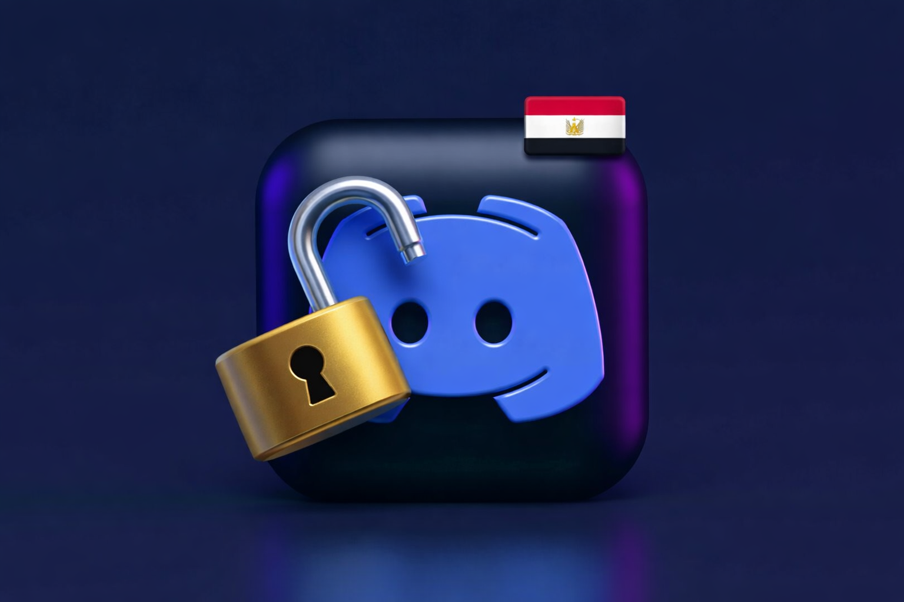

# 🔓 إلغاء حظر Discord في مصر (2026) - دليل

<div align="center">



[](https://github.com/AhmedV20/discord-egypt-guide/stargazers)  [](https://github.com/AhmedV20/discord-egypt-guide/network/members)  [](LICENSE)  [](https://github.com/AhmedV20/discord-egypt-guide/actions)

**[English](README.md)** | العربية

دليل شامل لعام 2026 لفتح Discord في مصر - 4 طرق مجربة (WARP, Vesktop, Discord-Drover, VPN) مع شرح خطوة بخطوة. حلول مجانية متوفرة! 🇪🇬

</div>

<div dir="rtl" align="right">

> [!NOTE]
> ⚠️ **مشاكل في الاتصال؟** لم يتم حظر Discord رسمياً في مصر، لكن المستخدمين يواجهون حجباً متكرراً من مزودي الخدمة مثل WE وفودافون وأورانج واتصالات. يقدم هذا الدليل **4 حلول عاملة** محدثة ليناير 2026.

---

## جدول المحتويات

- [الطريقة الأولى: Cloudflare WARP (الأسهل والمجاني)](#الطريقة-الأولى-cloudflare-warp-الأسهل-والمجاني---موصى-به-للمبتدئين)
- [الطريقة الثانية: Vesktop (بدون VPN)](#الطريقة-الثانية-vesktop-بدون-vpn---عميل-discord-بديل)
- [الطريقة الثالثة: Discord-Drover (إصلاح الصوت)](#الطريقة-الثالثة-discord-drover-إصلاح-الصوت---windows-فقط)
- [الطريقة الرابعة: VPN - Windscribe (خصوصية كاملة)](#الطريقة-الرابعة-vpn---windscribe-خصوصية-كاملة---10-جيجا-مجاناً)
- [المشاكل الشائعة في مصر](#المشاكل-الشائعة-في-مصر)
- [مقارنة الطرق](#مقارنة-الطرق)
- [المساهمة](#المساهمة)
- [الترخيص](#الترخيص)

---

## الطريقة الأولى: Cloudflare WARP (الأسهل والمجاني - موصى به للمبتدئين)

### الوصف

Cloudflare WARP هي خدمة مجانية خفيفة تشبه VPN تقوم بتوجيه حركة المرور عبر شبكة Cloudflare العالمية باستخدام محلل DNS 1.1.1.1. تقوم بتشفير اتصالك وتجاوز القيود الإقليمية دون التأثير بشكل كبير على السرعة.

### المميزات

- **مجانية** — لا تحتاج اشتراك للوظائف الأساسية
- **سريعة** — تقليل طفيف في السرعة بفضل شبكة Cloudflare المحسنة
- **خفيفة** — استهلاك منخفض لموارد النظام
- **متعددة المنصات** — متوفرة على Windows وmacOS وLinux وiOS وAndroid
- **حماية دائمة** — تشفير تلقائي لكل حركة مرور الجهاز

### العيوب

- خيارات محدودة لمواقع الخوادم (لا يمكن اختيار دول محددة)
- قد لا تعمل إذا تم حجب عناوين IP الخاصة بـ Cloudflare
- لا يوجد انقسام للنفق على الهاتف
- انقطاعات عرضية أثناء ساعات الذروة

### المتطلبات

| المتطلب | التفاصيل |
|---------|----------|
| **نظام التشغيل** | Windows 10+، macOS 10.14+، Linux، iOS 14+، Android 5+ |
| **صلاحيات المسؤول** | مطلوبة للتثبيت |
| **حساب** | اختياري (يعمل بدون تسجيل دخول) |
| **المساحة** | ~100 ميجابايت |

### خطوات التثبيت

**Windows/macOS:**

1. قم بتحميل برنامج التثبيت من الموقع الرسمي.
2. شغّل ملف التثبيت المحمّل.
3. اتبع معالج التثبيت.
4. شغّل تطبيق "1.1.1.1" من قائمة التطبيقات.
5. اضغط على زر التبديل الكبير لتفعيل WARP.
6. انتظر حتى تتغير الحالة إلى "متصل".
7. افتح Discord — يجب أن يتصل الآن بنجاح.

**الهاتف (iOS/Android):**

1. افتح App Store (iOS) أو Google Play Store (Android).
2. ابحث عن "1.1.1.1 Cloudflare WARP".
3. ثبّت التطبيق الرسمي من Cloudflare.
4. افتح التطبيق واقبل الشروط.
5. اضغط على زر التبديل لتفعيل WARP.
6. امنح صلاحيات تكوين VPN عند الطلب.
7. شغّل Discord.

### روابط التحميل الرسمية

| المنصة | الرابط |
|--------|--------|
| Windows/macOS | https://one.one.one.one/ |
| iOS | https://apps.apple.com/app/id1423538627 |
| Android | https://play.google.com/store/apps/details?id=com.cloudflare.onedotonedotonedotone |
| Linux | https://pkg.cloudflareclient.com/ |

### حل المشاكل

| المشكلة | الحل |
|---------|------|
| WARP لا يتصل | أعد تشغيل التطبيق ← عطّل VPNs أخرى ← تحقق من إعدادات جدار الحماية |
| سرعات بطيئة | بدّل بين وضعي WARP وWARP+ ← جرب شبكة مختلفة |
| Discord لا يزال محجوباً | فعّل وضع "1.1.1.1 for Families" ← امسح ذاكرة Discord المؤقتة |
| التطبيق يتعطل عند البدء | أعد تثبيت التطبيق ← حدّث لأحدث إصدار |

### لقطة الشاشة


---

## الطريقة الثانية: Vesktop (بدون VPN - عميل Discord بديل)

### الوصف

Vesktop هو عميل Discord مفتوح المصدر من طرف ثالث مبني بـ Electron. يتضمن تعديلات وإصلاحات مدمجة تسمح له بتجاوز القيود الإقليمية. على عكس عميل Discord الرسمي، يوجه Vesktop الاتصالات بشكل مختلف، مما يتجاوز الحجب غالباً.

### المميزات

- **مفتوح المصدر** — كود شفاف، مراجع من المجتمع
- **تجاوز مدمج** — يعمل بدون VPN أو بروكسي إضافي
- **تكامل Vencord** — يتضمن تحسينات Discord الشائعة
- **خفيف** — يستخدم ذاكرة أقل من Discord الرسمي
- **موجه للخصوصية** — لا يوجد تتبع

### العيوب

- عميل طرف ثالث (غير مدعوم رسمياً من Discord)
- قد يتأخر عن تحديثات Discord الرسمية
- مخاوف محتملة بشأن شروط الخدمة
- لا يوجد إصدار رسمي للهاتف
- قد يتطلب صوت مشاركة الشاشة إعداداً إضافياً على Linux

### المتطلبات

| المتطلب | التفاصيل |
|---------|----------|
| **نظام التشغيل** | Windows 10+، macOS 10.15+، Linux |
| **صلاحيات المسؤول** | مطلوبة للتثبيت |
| **حساب** | حساب Discord موجود |
| **المساحة** | ~200 ميجابايت |

### خطوات التثبيت

**Windows:**

1. اذهب إلى https://vesktop.dev/install/windows/
2. اضغط على "Download Vesktop Installer" (موصى به) أو حمّل النسخة المحمولة `.zip`.
3. شغّل برنامج التثبيت واتبع التعليمات.
4. شغّل Vesktop من قائمة Start أو اضغط "Finish" بعد نجاح التثبيت.
5. انتظر بضع ثوانٍ عند أول تشغيل — يحتاج التطبيق وقتاً للتهيئة وتحميل شاشة تسجيل الدخول.
6. سجّل الدخول ببيانات Discord الخاصة بك.

**macOS:**

1. اذهب إلى https://vesktop.dev/install/mac/
2. اضغط على "Download Vesktop DMG".
3. افتح `.dmg` واسحب Vesktop إلى Applications.
4. اضغط بزر الماوس الأيمن على Vesktop ← Open (مطلوب لأول تشغيل).
5. سجّل الدخول بحساب Discord الخاص بك.

*بديل:* التثبيت عبر Homebrew: `brew install --cask vesktop`

**Linux:**

1. اذهب إلى https://vesktop.dev/install/linux/
2. اختر الصيغة المفضلة:
   - **Flatpak:** اضغط على "Download on Flathub"
   - **Debian/Ubuntu:** حمّل حزمة `.deb`
   - **Fedora/RHEL:** حمّل حزمة `.rpm`
   - **Arch Linux:** ثبّت من AUR (`vesktop` أو `vesktop-git`)
   - **AppImage:** حمّل وشغّل بـ `chmod +x`
3. شغّل Vesktop وسجّل الدخول.

### روابط التحميل الرسمية

| المنصة | الرابط |
|--------|--------|
| Windows | https://vesktop.dev/install/windows/ |
| macOS | https://vesktop.dev/install/mac/ |
| Linux | https://vesktop.dev/install/linux/ |
| GitHub Releases | https://github.com/Vencord/Vesktop/releases |

### حل المشاكل

| المشكلة | الحل |
|---------|------|
| شاشة تسجيل الدخول لا تحمّل | امسح ذاكرة Vesktop المؤقتة ← تحقق من اتصال الإنترنت |
| خطأ "Minimum OS version" | حدّث نظام التشغيل |
| شاشة بيضاء/فارغة | عطّل تسريع الأجهزة في الإعدادات |
| الدردشة الصوتية لا تعمل | تحقق من صلاحيات الصوت ← أعد تشغيل Vesktop |
| عالق على التحميل | احذف `%appdata%/Vesktop` (Windows) أو `~/.config/vesktop` (Linux) |

### لقطة الشاشة


---

## الطريقة الثالثة: Discord-Drover (إصلاح الصوت - Windows فقط)

### الوصف

Discord-Drover هو ملف DLL يجبر Discord على استخدام بروكسي محدد (HTTP/SOCKS5) لاتصالات TCP. يتجاوز القيود المحلية على الدردشة الصوتية عن طريق التلاعب بحركة UDP على مستوى العملية، دون الحاجة إلى برامج تشغيل أو تعديلات على مستوى النظام.

### المميزات

- **مصمم خصيصاً** — مصمم تحديداً للوصول إلى Discord وتجاوز حجب الصوت
- **خفيف** — يعمل على مستوى العملية بدون تعديلات النظام
- **بدون VPN شامل** — يؤثر فقط على حركة مرور Discord
- **الوضع المباشر** — يمكنه تجاوز قيود الصوت بدون بروكسي
- **يدعم إصدارات Discord** — يعمل مع Discord وCanary وPTB

### العيوب

- Windows فقط
- يتطلب خادم بروكسي للوظائف الكاملة (أو استخدم الوضع المباشر)
- قد يحتاج إعادة تكوين بعد تحديثات Discord
- حقن DLL من طرف ثالث

### المتطلبات

| المتطلب | التفاصيل |
|---------|----------|
| **نظام التشغيل** | Windows 10+ |
| **صلاحيات المسؤول** | غير مطلوبة |
| **حساب** | حساب Discord موجود |
| **اختياري** | خادم بروكسي HTTP/SOCKS5 |

### خطوات التثبيت

**التثبيت التلقائي (موصى به):**

1. اذهب إلى https://github.com/hdrover/discord-drover/releases/latest
2. حمّل `drover.exe` من أحدث إصدار.
3. شغّل `drover.exe`.
4. اضبط إعدادات البروكسي في المثبّت:
   - أدخل عنوان البروكسي (مثال: `http://127.0.0.1:1080`)
   - أو اختر **الوضع المباشر** لتجاوز قيود الصوت بدون بروكسي
5. اضغط **Install** — يتم وضع الملفات تلقائياً في مجلد Discord الصحيح.
6. شغّل Discord — سيستخدم الآن البروكسي المُعد.

**لإلغاء التثبيت:** شغّل `drover.exe` مرة أخرى واضغط **Uninstall**.

**التثبيت اليدوي:**

1. حمّل `version.dll` و`drover.ini` من صفحة الإصدارات.
2. حدد مجلد تثبيت Discord الذي يحتوي على `Discord.exe` (وليس `Update.exe`).
3. انسخ `version.dll` و`drover.ini` إلى ذلك المجلد.
4. عدّل `drover.ini` لتكوين البروكسي:
   ```ini
   [drover]
   proxy = http://127.0.0.1:1080
   ```
5. شغّل Discord.

> [!TIP]
> في مصر، إذا كان Discord يعمل لكن الدردشة الصوتية محجوبة، استخدم **الوضع المباشر** (اترك البروكسي فارغاً) لتجاوز قيود الصوت بدون الحاجة لخادم بروكسي.

### روابط التحميل الرسمية

| المورد | الرابط |
|--------|--------|
| مستودع GitHub | https://github.com/hdrover/discord-drover |
| أحدث إصدار | https://github.com/hdrover/discord-drover/releases/latest |

### حل المشاكل

| المشكلة | الحل |
|---------|------|
| Discord لا يبدأ بعد التثبيت | تحقق من أن `version.dll` في نفس مجلد `Discord.exe` |
| الدردشة الصوتية لا تزال محجوبة | جرب الوضع المباشر أو تحقق من إعدادات البروكسي في `drover.ini` |
| البروكسي لا يعمل | تحقق من تشغيل خادم البروكسي ← تحقق من صيغة البروكسي في الإعدادات |
| تحتاج تحديث بعد تحديث Discord | شغّل `drover.exe` مرة أخرى واضغط Install |

### لقطة الشاشة


---

## الطريقة الرابعة: VPN - Windscribe (خصوصية كاملة - 10 جيجا مجاناً)

### الوصف

VPN (الشبكة الخاصة الافتراضية) تشفّر حركة الإنترنت وتوجهها عبر خوادم في دول أخرى، مخفية موقعك الحقيقي. Windscribe هي مزود VPN موثوق تقدم طبقة مجانية سخية بـ 10 جيجابايت شهرياً والوصول إلى أكثر من 10 دول.

### المميزات

- **تشفير كامل** — تحمي كل حركة الإنترنت
- **اختيار الخادم** — الاتصال بدول محددة
- **طبقة مجانية سخية** — 10 جيجابايت/شهر مع التحقق من البريد
- **ميزات إضافية** — حجب الإعلانات، جدار حماية، انقسام النفق
- **متعددة المنصات** — تدعم جميع المنصات الرئيسية

### العيوب

- حد 10 جيجابايت شهرياً في الخطة المجانية
- سرعات أبطأ أثناء أوقات الذروة
- تتطلب تسجيل حساب
- الخوادم المجانية قد تكون مزدحمة
- بعض خدمات البث قد تكون محجوبة

### المتطلبات

| المتطلب | التفاصيل |
|---------|----------|
| **نظام التشغيل** | Windows 7+، macOS 10.11+، Linux، iOS 12+، Android 5+ |
| **صلاحيات المسؤول** | مطلوبة للتثبيت |
| **حساب** | مطلوب (طبقة مجانية متاحة) |
| **المساحة** | ~150 ميجابايت |

### خطوات التثبيت

**Windows/macOS:**

1. اذهب إلى موقع Windscribe وأنشئ حساباً مجانياً.
2. تحقق من بريدك الإلكتروني لفتح 10 جيجابايت شهرية (2 جيجابايت بدون تحقق).
3. حمّل عميل سطح المكتب لنظامك.
4. شغّل برنامج التثبيت وأكمل الإعداد.
5. شغّل Windscribe وسجّل الدخول.

**إعداد Split Tunneling (موصى به لـ Discord فقط):**

6. اضغط على القائمة (☰) → **Connection**.
7. ابحث عن **Split Tunneling** وغيّر الوضع إلى **Inclusive**.
8. اضغط **Apps** وأضف هذه الملفات:
   - `Discord.exe` — موجود على اختصار سطح المكتب أو قائمة Start
   - `Update.exe` — موجود في `C:\Users\اسم_المستخدم\AppData\Local\Discord\`
   
   > **نصيحة:** اضغط بزر الماوس الأيمن على أيقونة Discord ← Properties ← Open File Location للعثور على `Update.exe`

9. ارجع إلى إعدادات **Connection** واضبط:
   - **Firewall Mode:** Manual
   - **Connection Mode:** Manual
   - **Protocol:** Stealth
   - **Port:** 443

10. ارجع إلى الشاشة الرئيسية واضغط زر الطاقة للاتصال.
11. اختر خادماً محدداً أو اختر "Best Location" (يختار Windscribe الأسرع).
12. افتح Discord — يجب أن يعمل فوراً.

**الهاتف:**

1. حمّل Windscribe من App Store أو Google Play.
2. أنشئ حساباً أو سجّل الدخول.
3. امنح صلاحيات VPN عند الطلب.
4. اضغط على زر الطاقة أو اختر موقعاً.
5. شغّل Discord.

**إضافة المتصفح (بديل سريع):**

1. ثبّت إضافة Windscribe لـ Chrome/Firefox.
2. سجّل الدخول بحسابك.
3. فعّل البروكسي.
4. استخدم Discord في المتصفح (discord.com).

### روابط التحميل الرسمية

| المنصة | الرابط |
|--------|--------|
| Windows | https://windscribe.com/download |
| macOS | https://windscribe.com/download |
| Linux | https://windscribe.com/download |
| iOS | https://apps.apple.com/app/id1129435228 |
| Android | https://play.google.com/store/apps/details?id=com.windscribe.vpn |
| إضافة Chrome | https://chrome.google.com/webstore/detail/windscribe/hnmpcagpplmpfojmgmnngilcnanddlhb |
| إضافة Firefox | https://addons.mozilla.org/addon/windscribe/ |

### حل المشاكل

| المشكلة | الحل |
|---------|------|
| لا يمكن الاتصال بالخوادم | جرب موقع خادم مختلف ← تحقق من إعدادات جدار الحماية |
| سرعات بطيئة | انتقل إلى خادم أقرب ← جرب بروتوكول IKEv2 |
| "Bandwidth limit reached" | ترقّ إلى خطة مدفوعة ← انتظر إعادة التعيين الشهرية |
| VPN ينقطع عشوائياً | فعّل وضع "Firewall" ← حدّث التطبيق |
| مشاكل صوت Discord | عطّل "Reduce Latency" ← جرب بروتوكول UDP |

### لقطة الشاشة


---

## المشاكل الشائعة في مصر

### الحجب على مستوى مزود الخدمة

| المشكلة | الحل |
|---------|------|
| Discord محجوب على مزود معين (مثل WE، فودافون، أورانج، اتصالات) | جرب طريقة مختلفة من هذا الدليل — الفعالية تختلف حسب المزود |
| الحجب مستمر بعد الاتصال بـ VPN | امسح ذاكرة DNS: `ipconfig /flushdns` (Windows) أو `sudo dscacheutil -flushcache` (macOS) |
| وصول متقطع | تم اكتشاف خنق من مزود الخدمة — استخدم بروتوكولات VPN مموهة أو WARP |

### مشاكل الاتصال

| المشكلة | الحل |
|---------|------|
| Discord عالق على "جاري الاتصال" | عطّل جدار حماية Windows مؤقتاً ← تحقق مما إذا كان مكافح الفيروسات يحجب Discord |
| الصوت/الفيديو لا يعمل | فعّل UDP في الراوتر ← اسمح لـ Discord عبر جدار الحماية |
| الرسائل تُرسل لكن لا تُستقبل | أعد تشغيل Discord ← امسح الذاكرة المؤقتة المحلية |
| صفحة تسجيل الدخول لا تحمّل | غيّر DNS إلى `1.1.1.1` أو `8.8.8.8` يدوياً |

### حجب متعلق بـ DNS

| المشكلة | الحل |
|---------|------|
| discord.com لا يُحل | غيّر خوادم DNS في إعدادات الشبكة |
| أخطاء شهادة SSL | تحقق من تاريخ/وقت النظام ← حدّث الشهادات الجذرية |

**خوادم DNS الموصى بها لمصر:**

| المزود | أساسي | ثانوي |
|--------|--------|--------|
| Cloudflare | 1.1.1.1 | 1.0.0.1 |
| Google | 8.8.8.8 | 8.8.4.4 |
| Quad9 | 9.9.9.9 | 149.112.112.112 |

### مشاكل خاصة بالهاتف

| المشكلة | الحل |
|---------|------|
| تطبيق Discord لا يتصل على بيانات الهاتف | استخدم WiFi مع WARP مفعّل ← شركات الاتصالات لديها حجب أقوى |
| WARP يستنزف البطارية | عطّل "Always On" وفعّل فقط عند استخدام Discord |
| طلب صلاحية VPN باستمرار | فعّل "Always-on VPN" في إعدادات Android |

### مشاكل ما بعد الاتصال

| المشكلة | الحل |
|---------|------|
| Discord يعمل لكنه بطيء جداً | اتصل بخادم VPN أقرب ← استخدم WARP بدلاً من VPN كامل |
| مشاركة الشاشة لا تعمل | تحقق مما إذا كان UDP مسموحاً ← جرب Vesktop لتوافق أفضل |
| إشعارات Push متأخرة | أضف Discord/VPN للقائمة البيضاء في إعدادات تحسين البطارية |

---

## مقارنة الطرق

| الميزة | WARP | Vesktop | Discord-Drover | VPN (Windscribe) |
|--------|------|---------|----------------|------------------|
| **التكلفة** | مجاني | مجاني | مجاني | مجاني (10 جيجا/شهر) |
| **سهولة الإعداد** | سهل | سهل | متوسط | سهل |
| **التأثير على السرعة** | طفيف | لا يوجد | طفيف | متوسط |
| **دعم المنصات** | الكل | سطح المكتب | Windows | الكل |
| **تشفير كل الحركة** | نعم | لا | لا | نعم |
| **يتطلب حساب** | لا | Discord | لا | نعم |
| **مفتوح المصدر** | لا | نعم | نعم | لا |
| **الأفضل لـ** | استخدام عام | مستخدمي سطح المكتب | المستخدمين التقنيين | خصوصية كاملة |

---

## توصية البدء السريع

**لمعظم المستخدمين في مصر:**

1. **جرب WARP أولاً** — أسهل إعداد، يعمل مع معظم مزودي الخدمة
2. **إذا فشل WARP** — ثبّت Vesktop كعميل Discord
3. **للهاتف** — استخدم تطبيق Windscribe أو WARP
4. **للخصوصية الكاملة** — استخدم خدمة VPN مدفوعة

---

## المساهمة

المساهمات مرحب بها! راجع [CONTRIBUTING.md](CONTRIBUTING.md) للإرشادات.

**طرق سريعة للمساعدة:**
- الإبلاغ عن طرق توقفت عن العمل
- اقتراح طرق تجاوز جديدة
- إصلاح الأخطاء أو المعلومات القديمة
- إضافة ترجمات

---

## إخلاء المسؤولية

هذا الدليل مقدم لأغراض تعليمية. المستخدمون مسؤولون عن الامتثال للقوانين المحلية وشروط خدمة Discord. الطرق الموصوفة هي حلول بديلة للقيود التقنية وقد لا تكون حلولاً دائمة.

---

## الترخيص

هذا المشروع مرخص بموجب رخصة MIT. انظر [LICENSE](LICENSE) للتفاصيل.

</div>
